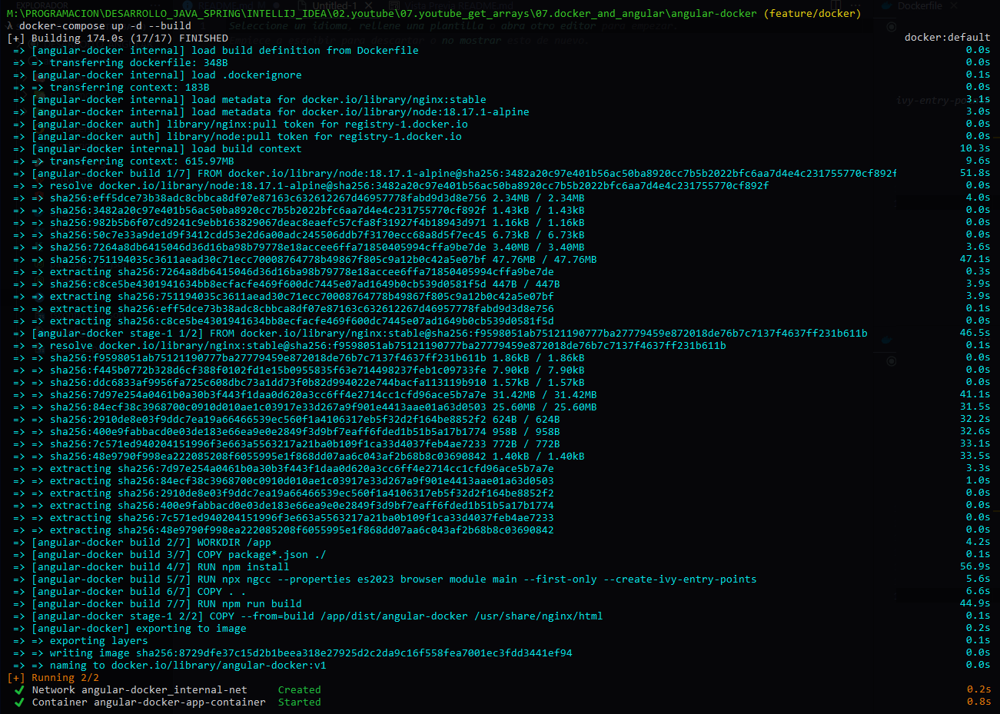
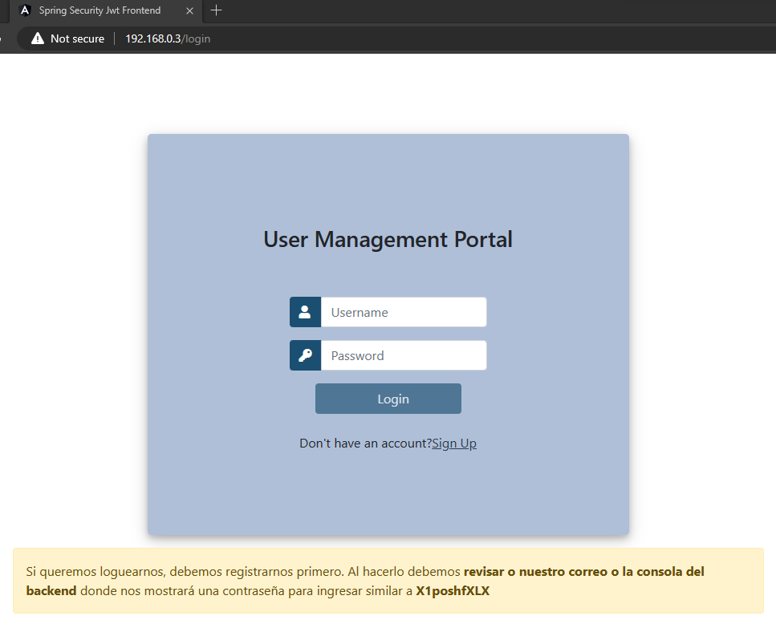
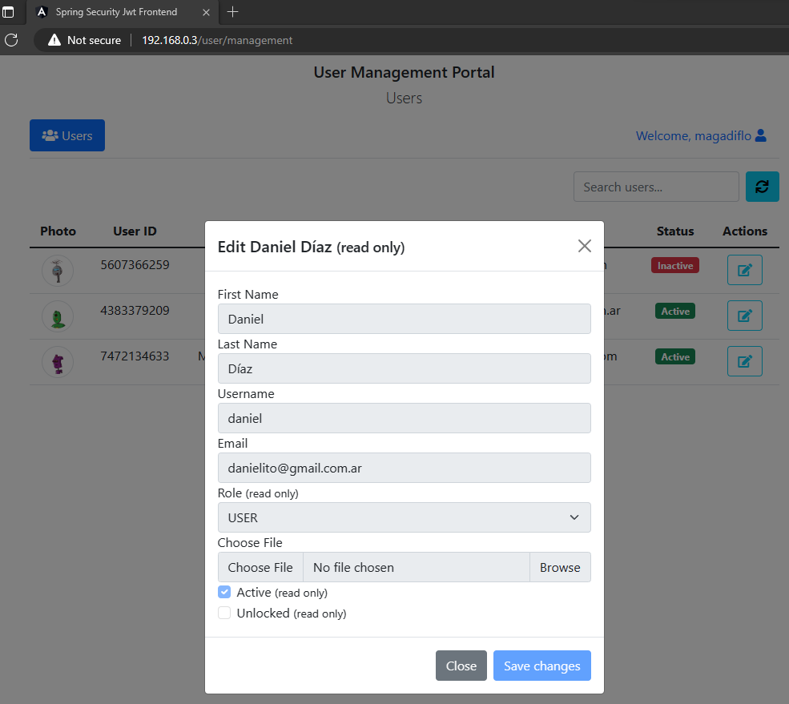

# [Dockerize an Angular Application using Nginx](https://www.youtube.com/watch?v=-o5l6zFJ9_o)

This project was generated with [Angular CLI](https://github.com/angular/angular-cli) version 13.0.4.

Tutorial tomado del canal de [Get Arrays](https://www.youtube.com/watch?v=-o5l6zFJ9_o)

---

## Sobre el proyecto base

Este tutorial trata sobre **cómo dockerizar un proyecto de Angular usando Nginx**. El autor, que es **Junior de Get Arrays** utiliza el proyecto de Angular realizado en su curso **Full Stack Spring Boot API with Angular (ADVANCED)**. En mi caso, como no tengo acceso a ese curso, es que optaré por usar el proyecto de Angular realizado en su curso de Udemy, curso que por cierto compré.

El proyecto original de Angular tomado del curso de Udemy está en mi repositorio [spring-security-jwt-frontend](https://github.com/magadiflo/spring-security-jwt-frontend.git). Como observamos tiene el nombre `spring-security-jwt-frontend`. Ahora, para este proyecto con Docker, lo que haré será copiar el proyecto original y renombrarlo a `angular-docker`. Es importante tener en cuenta que este proyecto funciona con un backend que está en mi repositorio [spring-security-jwt-backend](https://github.com/magadiflo/spring-security-jwt-backend.git)

> En **resumen**, utilizaré este proyecto **angular-docker** para realizar el tutorial de **cómo dockerizar una aplicación de angular usando Nginx**.

---

## Dockerfile

En esta sección crearemos las configuraciones en el archivo `Dockerfile`. Un Dockerfile es un archivo de texto que contiene las instrucciones necesarias para crear una nueva imagen. 

Trabajaremos con un archivo **Dockerfile multi-stage**, es decir, dividiremos la construcción de la imagen en varias etapas. 

Crearemos el archivo `Dockerfile` en la raíz del proyecto de Angular y agregaremos las siguientes configuraciones, posteriormente iré explicando línea a línea lo que hace cada instrucción:

````Dockerfile
# Primera etapa
FROM node:18.17.1-alpine AS build
WORKDIR /app
COPY package*.json ./
RUN npm install
RUN npx ngcc --properties es2023 browser module main --first-only --create-ivy-entry-points
COPY . .
RUN npm run build

# Segunda etapa
FROM nginx:stable
COPY --from=build /app/dist/angular-docker /usr/share/nginx/html
EXPOSE 80
````

### Primera etapa: build de la aplicación.

- `FROM node:18.17.1-alpine AS build`, configuramos la imagen base que se utilizará en las instrucciones posteriores y también estamos asignando un nombre o alias a esta etapa en la construcción de la imagen. Entonces, la imagen base que usaremos será `node` cuya versión o tag que usaremos será la `18.17.1-alpine` y finalmente le daremos un alias a esta etapa llamado `build`.
- `WORKDIR /app`, creamos un directorio de trabajo al que le llamaremos `/app`. La razón por la que creamos un directorio de trabajo es por que si por algún motivo necesitamos ir dentro del contenedor en ejecución, entonces sabremos exactamente a qué carpeta ir para ver los archivos que vamos a copiar dentro. En pocas palabras, en este directorio de trabajo colocaremos nuestra aplicación o los archivos que utilicemos en la construcción de nuestra aplicación.
- `COPY package*.json ./`, con esta instrucción copiará los archivos `package.json` y `package-lock.json` (por eso usamos el `*`) dentro de nuestro directorio de trabajo `/app`. Es decir, a partir de ahora, cuando coloquemos el `./` o solo el `.` **estaremos haciendo referencia al directorio de trabajo que creamos en la instrucción anterior** `/app`.
- `RUN npm install`, iniciamos la instalación de todas las dependencias del node_modules que están definidas en el archivo `package.json`.


- `RUN npx ngcc --properties es2023 browser module main --first-only --create-ivy-entry-points`, este comando podríamos omitirlo, pero según Junior dice que **es mejor ejecutarlo a que no hacerlo**. El `npx` también proviene del node package manager y significa Node Package Executor, esto significa que simplemente es un package runner, por lo que todo lo que existe en el registro npm podemos ejecutarlo usando npx. Ahora, lo que queremos ejecutar en este caso es el `ngcc` que es el **Compilador de Compatibilidad de Angular (ng)**, es una herramienta utilizada para compilar librerías que se han publicado en formato `Legacy` y se usa cuando las librerías no son compatibles con el tiempo de ejecución `ivy` de Angular, por lo que podemos formatearla en un formato que sea compatible con el `ivy`. La bandera `--properties` está especificando el formato para que todos los paquetes se procesen en el `es2023`, que es el `EcmaScript 2023` (versión de javascript) y el módulo del navegador como principal. La bandera `--first-only` significa que el `ngcc` procesará la primera propiedad que encuentre en el `package.json`, por lo que, cosas como `es2015` tienen un valor predeterminado que usará, por eso lo anulamos con esa bandera `--first-only`. El `--create-ivy-entry-points` le indicará al comando `ngcc` que cree nuevas propiedades para la entrada generada.


  > En resumen, todo ese comando está relacionado con el navegador, de modo que el archivo de JavaScript generado cuando ejecutamos el `ng build` para construir esta aplicación, pueda ser compatible con la mayoría de los navegadores. Solo necesitamos comprender que ese comando es importante y que es mejor ejecutar ese comando a que no lo ejecutemos.

- `COPY . .`, le decimos que copie todos los archivos y directorios que estén en la misma raíz que el `Dockerfile` (en los subdirectorios también) y los pegue dentro del working directory `/app`. El segundo punto `.` al igual que usamos el `./` en una instrucción superior, hacen referencia al working directory `/app`.
- `RUN npm run build`, si abrimos el `package.json` observaremos que tenemos dentro de los `scripts` una instrucción `build: ng build`. Bueno nosotros utilizaremos el npm para poder ejecutar el `build`. Con esta instrucción haremos `build` de nuestro proyecto de Angular.

### Segunda etapa: Contruyendo imagen

- `FROM nginx:stable`, en esta segunda etapa le diremos que utilizaremos la imagen del servidor web `nginx` cuya versión será la `stable`.
- `COPY --from=build /app/dist/angular-docker /usr/share/nginx/html`, le decimos que copie desde la etapa anterior `build` (por eso fue importante definirle el alias) todo lo que tenga en su directorio `/app/dist/angular-docker`, que es el resultado precisamente de toda la etapa `build`, que lo copie en el directorio de `/usr/share/nginx/html` que corresponde a esta nueva imagen base (nginx:stable). En resumen, el resultado de la etapa `build` lo copiaremos dentro del directorio del servidor de `nginx` donde ser sirven los archivos estáticos.
- `EXPOSE 80`, exponemos el puerto donde estará trabajando nuestra aplicación.

**NOTA**

> Recordar, como mencionó Andrés Guzmán en su curso de microservicios, el **EXPOSE** únicamente es a modo de documentación, para decirle al mundo qué puertos están disponibles.

## Docker Ignore

Creamos el archivo `.dockerignore` donde definiremos todo lo que no queremos que se copie cuando se use la instrucción `COPY`, es decir cuando copiamos cosas de nuestra pc local hacia dentro del contenedor.

Si observamos la instrucción `COPY . .` del `Dockerfile`, le estamos diciendo que copie todo lo que esté en la misma raíz del Dockerfile y los subdirectorios y los pegue en el working directory. Cuando usamos un `.dockerignore`, antes de que haga el copiado lo que hará será ver dicho archivo para poder omitir aquellos que hayan sido definidos dentro de él.

A continuación mostramos todas las rutas y directorios que ignoraremos. Como estamos trabajando con node.js utilizaremos todas las rutas y archivos que trabajan con él y lo ignoraremos, digamos que es como un estándar:

````Dockerfile
**/node_modules/
**/.git
**/README.md
**/LICENSE
**/.vscode
**/npm-debug-log
**/coverage
**/.env
**/.editorconfig
**/.aws
**/dist
````

## Compilando para el despliegue

En esta sección veremos qué archivos y directorios se generan cuando compilamos nuestro proyecto de Angular utilizando la CLI. El resultado de esto será lo mismo que se obtenga como resultado en la `primera etapa` del archivo `Dockerfile`. Aquí solo ejecutamos el `ng build` para poder ver qué archivos y directorios son creados, **nada más para verlos**:

````
|/dist/angular-docker/
|--/assets/image/angular.png
|--3rdpartylicenses.txt
|--favicon.ico
|--index.html
|--main.00f6a413b2f8c76d.js
|--polyfills.16fa819a51a21985.js
|--runtime.7a1e3d808ae4a804.js
|--scripts.abbb37f329463b12.js
|--styles.6f5074d0b0d22170.css
````

Listo, luego de ejecutar el `ng build` con el CLI de Angular, veremos que en nuestro proyecto local hay un directorio `/dist` y dentro de él nuestro proyecto compilado.

Ahora, en el archivo `package.json` tenemos el apartado de los `scripts` que a continuación lo muestro:

````json
{
  "scripts": {
      "ng": "ng",
      "start": "ng serve",
      "build": "ng build",
      "watch": "ng build --watch --configuration development",
      "test": "ng test"
    }  
}
````

Como observamos el script `watch` utiliza una bandera con un valor `--configuration development`, podemos usar esa misma idea para agregarlo en nuestro script `build` (script que se  usará en el archivo Dockerfile, primera etapa), de modo que ahora tendremos de esta manera nuestra configuración:

````json
{
  "scripts": {
      "ng": "ng",
      "start": "ng serve",
      "build": "ng build --configuration production",
      "watch": "ng build --watch --configuration development",
      "test": "ng test"
    }  
}
````

Como observamos, ahora en nuestro script `build` agregamos la bandera `--configuration` y su valor `production`, aunque en realidad **puede tener cualquier nombre**, no necesariamente debe llamarse `production`. 

Más adelante mostraremos **cómo lo usaremos en un entorno**, porque podemos tener diferentes entornos cada vez que creamos la aplicación (production, development, etc.). **En angular puede cambiar diferentes archivos de entorno** y luego aplicar las propiedades de estos archivos cada vez que ejecute la aplicación en un entorno específico.

## Environments

Tenemos dos archivos de **environments** en nuestra aplicación de Angular, el `environment.ts`, que es el de **desarrollo** y el `environment.prod.ts`, que es el de **producción**. 

Como vamos **colocar dentro de un contenedor** nuestra aplicación de angular, es importante que en el archivo de producción `environment.prod.ts` cambiemos el `localhost` por la `dirección ip` donde está corriendo nuestro backend. Si lo dejamos como `localhost` lo que sucederá es que la aplicación de angular buscará dentro de ese contenedor, es decir dentro de ese `localhost` la aplicación backend y obviamente eso fallará, ya que nuestra aplicación backend está corriendo en nuestra máquina local y no dentro del contedor donde está siendo ejecutado nuestra aplicación de angular. Por lo tanto, debemos cambiar por la dirección ip de nuestra pc local.

```typescript
//environment.prod.ts

export const environment = {
  production: true,
  apiUrl: 'http://192.168.0.3:8081',
};
```

## Docker Compose

Crearemos el archivo `docker-compose.yml` en el mismo nivel que el archivo `Dockerfile`:

````yaml
services:
  angular-docker:
    container_name: angular-docker-app-container
    build: .
    image: angular-docker:v1
    ports:
      - 80:80
    expose:
      - 80
    networks:
      - internal-net

networks:
  internal-net:
    driver: bridge
````

El `Dockerfile` se encuentra en el mismo nivel que el `docker-compose.yml`, eso representa el punto (.), el directorio actual.

## Running Container

Para correr la aplicación con docker compose debemos posicionarnos en la raíz del proyecto mediante la línea de comandos. En esta raíz es donde precisamente se encuentran el `Dockerfile` y `docker-compose.yml`.

````bash
docker-compose up -d --build
````

**DONDE**  
Fuente: [Laiba Razi Khan](https://laiba.hashnode.dev/docker-compose-up-build)

- `docker-compose up`, este subcomando se utiliza para crear y ejecutar contenedores para una aplicación definida en el archivo `docker-compose.yml`. Si los contenedores ya existen, este comando los iniciará si están detenidos.
- `-d` o `--detach`, este argumento opcional **indica a Docker Compose que ejecute los contenedores en segundo plano**, lo que significa que no verás la salida de registro en la terminal en tiempo real. Esto es útil para ejecutar contenedores en segundo plano y seguir utilizando la terminal para otros comandos.
- `--build`, este argumento **indica a Docker Compose que construya las imágenes de Docker si no existen o si han cambiado desde la última construcción.** Esto es útil cuando has realizado cambios en el código fuente de tus aplicaciones y necesitas reconstruir las imágenes antes de iniciar los contenedores.

Como resultado, vemos que se crea todo correctamente e inicia nuestro contenedor:



Listamos todos los `contenedores` que tenemos en nuestro `Docker` y vemos que dentro de ellos está nuestro contenedor de angular recién creado:

````bash
docker container ls -a

CONTAINER ID   IMAGE                    COMMAND                  CREATED              STATUS                      PORTS                NAMES
7058eca9acd3   angular-docker:v1        "/docker-entrypoint.…"   About a minute ago   Up About a minute           0.0.0.0:80->80/tcp   angular-docker-app-container
aae6ec2554bd   spring-boot-docker:dev   "java -jar app.jar"      4 weeks ago          Exited (143) 23 hours ago                        app-container-dev
````

Podemos entrar a ver el log dentro de nuestro contenedor de angular:

````bash
docker logs angular-docker-app-container

/docker-entrypoint.sh: /docker-entrypoint.d/ is not empty, will attempt to perform configuration
/docker-entrypoint.sh: Looking for shell scripts in /docker-entrypoint.d/
/docker-entrypoint.sh: Launching /docker-entrypoint.d/10-listen-on-ipv6-by-default.sh
10-listen-on-ipv6-by-default.sh: info: Getting the checksum of /etc/nginx/conf.d/default.conf
10-listen-on-ipv6-by-default.sh: info: Enabled listen on IPv6 in /etc/nginx/conf.d/default.conf
/docker-entrypoint.sh: Launching /docker-entrypoint.d/20-envsubst-on-templates.sh
/docker-entrypoint.sh: Launching /docker-entrypoint.d/30-tune-worker-processes.sh
/docker-entrypoint.sh: Configuration complete; ready for start up
2023/09/12 15:20:50 [notice] 1#1: using the "epoll" event method
2023/09/12 15:20:50 [notice] 1#1: nginx/1.24.0
2023/09/12 15:20:50 [notice] 1#1: built by gcc 10.2.1 20210110 (Debian 10.2.1-6)
2023/09/12 15:20:50 [notice] 1#1: OS: Linux 5.15.49-linuxkit-pr
2023/09/12 15:20:50 [notice] 1#1: getrlimit(RLIMIT_NOFILE): 1048576:1048576
2023/09/12 15:20:50 [notice] 1#1: start worker processes
2023/09/12 15:20:50 [notice] 1#1: start worker process 29
2023/09/12 15:20:50 [notice] 1#1: start worker process 30
2023/09/12 15:20:50 [notice] 1#1: start worker process 31
2023/09/12 15:20:50 [notice] 1#1: start worker process 32
````

Como todo está funcionando correctamente, **en nuestra pc local ingresamos por el navegador a nuestra aplicación de angular** que está dentro del contenedor de Docker.  

Recordemos que **configuramos el puerto externo de nuestro contenedor en el 80**, que es el mismo puerto que documentamos como un puerto expuesto (expose):



**IMPORTANTE**

- Si **no colocamos el puerto** en la url `http://192.168.0.3`, por defecto será el puerto `80`.
- Debemos utilizar la dirección **ip de nuestra pc local** `192.168.0.3`, que es donde está instalado `Docker` y cuyo puerto que expone el contenedor es el `80`. En otras palabras, para poder acceder al contenedor, necesitamos usar la dirección ip donde se encuentra y el puerto que expone.
- Como estamos accediendo a nuestra aplicación de angular a través de la dirección ip de nuestra pc local `http://192.168.0.3` con puerto predeterminado `80`, es importante **habilitar el cors en el backend para esta dirección**, sino el navegador nos bloqueará por esa política de cors:

  ````bash
  Access to XMLHttpRequest at 'http://192.168.0.3:8081/user/login' from origin 'http://192.168.0.3' has been blocked by CORS policy: Response to preflight request doesn't pass access control check: No 'Access-Control-Allow-Origin' header is present on the requested resource.      
  POST http://192.168.0.3:8081/user/login net::ERR_FAILED
  ````
  Habilitando en el backend la dirección ip de origen `http://192.168.0.3`. Note que también tenemos la dirección con la que trabajamos localmente nuestra aplicación de Angular antes de realizar todo el proceso de dockerización `localhost:4200`:

  ````java
  @Bean
	public CorsFilter corsFilter() {
		UrlBasedCorsConfigurationSource urlBasedCorsConfigurationSource = new UrlBasedCorsConfigurationSource();
		CorsConfiguration corsConfiguration = new CorsConfiguration();
    /* other configurations */
		corsConfiguration.setAllowedOrigins(Arrays.asList("http://localhost:4200", "http://192.168.0.3"));
		/* other configurations */
		return new CorsFilter(urlBasedCorsConfigurationSource);
	}
  ````

Ahora sí, nos registramos, obtenemos un password, iniciamos sesión y veremos algo similar:



